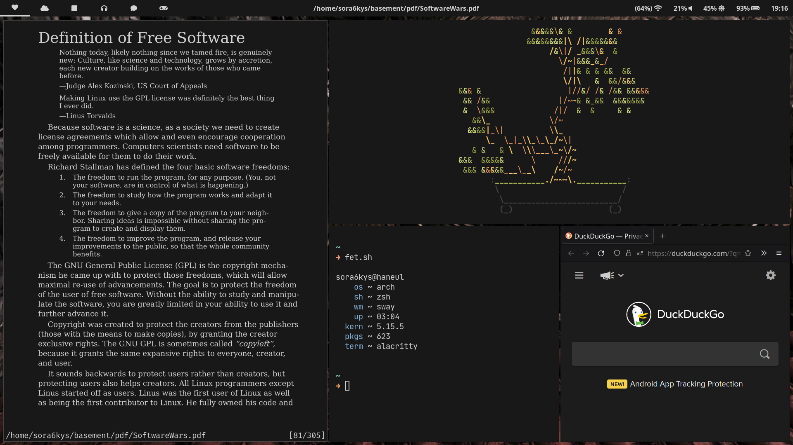

# sway-dots
for the configs to work properly install these pkgs:
- [waybar](https://github.com/Alexays/Waybar)
- [bemenu](https://github.com/Cloudef/bemenu)
- [mako](https://github.com/emersion/mako)
- [clipman](https://github.com/yory8/clipman)
- [playerctl](https://github.com/altdesktop/playerctl)
- [vim-plug](https://github.com/junegunn/vim-plug)
- [light](https://github.com/haikarainen/light) 

fonts:
- [font-awesome](https://archlinux.org/packages/community/any/ttf-font-awesome/)
- [noto-fonts](https://archlinux.org/packages/extra/any/noto-fonts/)
- [jetbrains-mono](https://www.jetbrains.com/lp/mono/)

## previews

